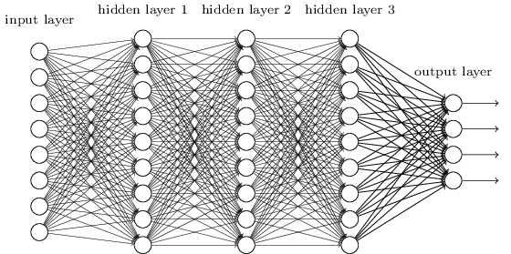
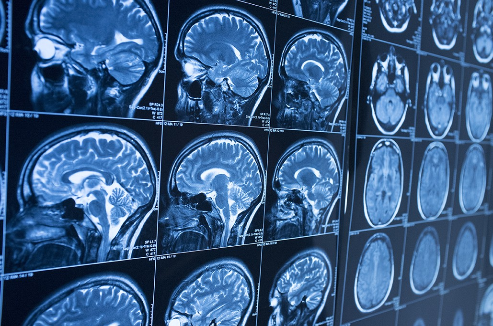
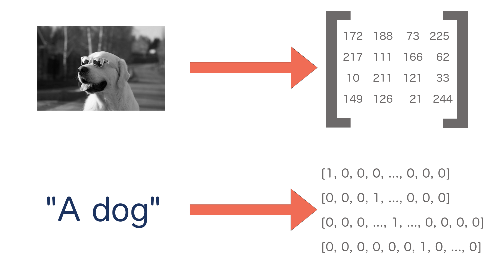
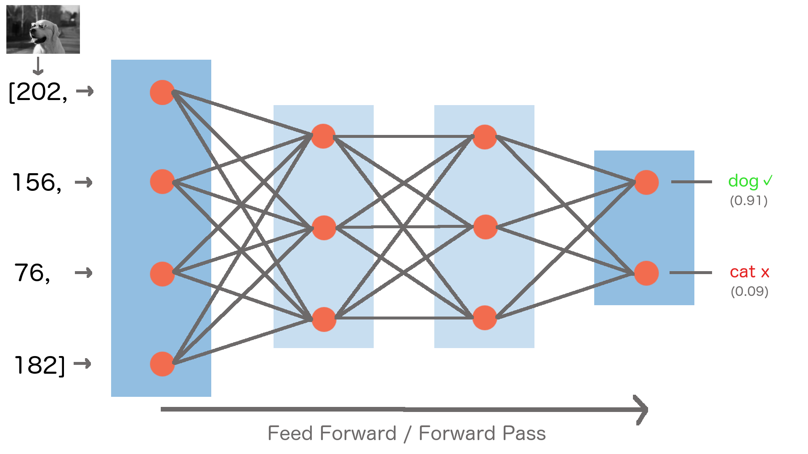
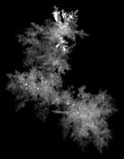

title: A Shallow Dive Into Deep Learning
url: https://www.lib.ncsu.edu
class: animation-fade
layout: true

<!-- This slide will serve as the base layout for all your slides -->
.bottom-bar[
  {{title}}&nbsp;&nbsp;&nbsp;&nbsp;&nbsp;&nbsp;{{url}}
]

---
# A Shallow Dive Into Deep Learning

## Kevin Beswick (@kbeswick)
## Bret Davidson

### NCSU Libraries

To see the speaker notes press "p"

???
BD Start

Great you're seeing the speaker notes!

Here are some notes for the speakers to control the slide deck:

- c: Create a clone presentation on a new window
- p: Toggle PresenterMode
- f: Toggle Fullscreen
- t: Reset presentation timer

---

</img>

???

You've probably heard a lot about machine learning in the news, and have
undoubtedly interacted with things that use it. We're going to talk
about what it is, what it can be used for, how it works and its
application in libraries.

---
# Computers are good at:

- Calculations
- Data storage and retrieval
- Displaying data
- Automation of routine tasks

# Computers are bad at:

- Pattern recognition
- Perception
- Generalization
- Inference

???

Let's set the stage a little bit. Here are some things that computers have traditionally been good at:

Things involving calculations, data storage, retrieval and display, and automating things that used to take a while todo manually, following well defined rules and structure.

We've seen these over and over again during the history of computing. These are things we've been able to do on a computer for a long time and we can do them at a fairly large scale now.

Here are some things that computers have traditionally been worse at.
- Pattern recognition
- perception (knowing what something is)
- generalization
- and inference (making predictions).

We have to explicitly tell a computer what something is, or manually define precise steps to follow in order to achieve some goal. These are some of the areas where deep learning is helping to improve the performance of computers.

---
class:impact
# SumaVision Demo

???
https://dli-ml.lib.ncsu.edu/sumavision/

We'll start off with a demo that maybe 5-7 years ago would have been very hard to accomplish using traditional computing tools.

To give some context, Suma is an application we manage in DLI for doing space analytics. Generally the way this is done is that someone walks through the library with an IPad and observes with their own eyes what people are doing in our spaces. They manually capture the number of people by navigating the space and pressing a button for each person they see.

---
# SumaVision Demo 1

<video controls src="videos/sumav_1.mov" type="video/mp4" class="img-squash img-center"/>

???

This is a demo to illustrate the power of the technology, so we'll leave ethical considerations aside for right now. What if we could capture images of a space and use that to count the number of people in a space?

We built this demo to show that we can do something like this pretty easily. You can see that this was captured in Suma.

---
# Machine Learning

- “A field of computer science that gives computers the ability to learn without being explicitly programmed”
  - https://en.wikipedia.org/wiki/Machine_learning

## Supervised Learning

- Inferring a function based on labeled training data

## Unsupervised Learning

- Inferring a function to describe hidden structure from "unlabeled" data

???
Examples:
- Linear regression / logistic regression
- Decision trees
- Random Forests

- Given a set of images that are labeled either “cat” or “dog”, train a model to predict whether unseen images are cats or dogs
- The majority of practical ML applications are supervised learning

Supervised learning is when we have an algorithm that learns how to make predictions based on labeled data it has access to in advance.

Examples of these are things like linear regression, logistic regression, and random forests. Most of the things you've heard about in the news or use everyday are primarily supervised learning.

If we have an algorithm and we feed it labeled images of cats and dogs, we can train it to evaluate an previously unseen, new image and classify it.

The other broad category is unsupervised learning, which is trying to make sense of an unlabled data set and then making predictions.

An example of this might be classifying unlabeled textual data.

This has been a less researched area, because it's a much harder problem.

- Given a set of images which aren’t labeled, use a model to cluster ones with similar properties into different categories

Examples:
- Clustering: K-means, hierarchical clustering, etc.

---
# Deep Learning
</img>

???
Subfield of machine learning that involves the use of deep artificial neural networks.

Loosely mimics how the human brain works with layers of neurons with connections between them.

Deep learning algorithms are neural networks, and they are a type of supervised learning. We train them with labeled data and then we make predictions on unlabeled data.

---
# Deep Learning vs. Traditional Machine Learning

* Generalizable
* More Powerful
* Domain Neutral
* Task Agnostic

???

Deep learning is generalizable and more powerful than traditional machine learning.

In traditional machine learning we have to manually define features, which is time intensive and requires domain expertise. Deep learning algorithms learn features automatically.

Neural networks don't need to know anything about the problem domain they are working in. In fact, they don't even know that they are operating on images. All they see are numbers.

The same deep learning algorithms can be used for different tasks. If I wanted to have an algorithm to tell me if an image is a cat or a dog, it could also tell me if something was a hot dog or a pizza.

The code doesn't need to change, only the data being used to train the network.

---
class:impact
# What is deep learning good for anyway?

???
Let's talk about what problems deep learning is good at solving and specific examples of its applications.

---

# Computer Vision
- Image classification
- Object detection/localization
- Image captioning

</img>
</img>

???

One area is computer vision, which is concerned with recognizing what is in an image and where objects are within an image.

This is used in areas like image classification, object detection, self-driving cars, and medical imagery.

---
# Natural Language Processing
  - Machine translation
  - Language modeling
  - Word embedding

 </img>

???
Deep learning is also used for NLP problems like translation and identifying concept similarity within text.

---
# Audio processing
  - Speech-to-text
  - Text-to-speech

</img>

???
Digital assistant examples fall here. For example, take an audio file of a human voice and put it into text so a machine can act on it.

---
class: impact
# How do neural networks work?

???
KB Start

Let's take a look at how deep neural networks actually work.

---

# High Level Process

- Define a prediction problem: given x, can I predict y?
  - Example: given an image, can I predict whether it is of a cat or a dog?

- Gather training data
  - Images of cats and dogs that are already labeled "cat" or "dog"

- Given this set of labeled training data, train a model that can
  make predictions given new, unseen images.

???

The general process we'll have to go through to train a neural network
is as follows:

read slide

---

# Everything is Numbers

</img>

???

The first point I want to make is that everything is numbers to a neural
network. So we're making predictions on things like images and text, but
first we need to represent these numerically. Computers already do this
behind the scenes in a lot of cases.

For black and white images, we can represent them as a matrix of numbers, where each
number represents the intensity of a particular pixel (or how light/dark
it is). For colored images, each number would be a set of 3 numbers that
represent the intensity of Red, Green, and Blue colors in a given pixel.

There are similar approaches for text and other data.

---

# Neural Network Model

</img>

???

Here's what a standard neural network looks like. They are organized as
stacked layers of neurons, with connections between them. Each of these
connections has a numerical weight that represents how strong the
connection is, and these are what we need to learn as part of the
training process.

Our input image is fed into the network through the input layer on the left. The data flows
through the neurons and connections in the hidden layers in the middle, until a prediction is made at the output layer at the
end of the network. Earlier hidden layers learn abstract features like edges of the image, while later
layers learn more specific features like noses, ears, tails.
Here you can see the network has predicted the image
is a dog with 91% confidence.

---

# Trained Model

- Weights are set to values such that model makes good predictions on
  training set
  - Training set should be a representative view of reality in order to
    generate a good model
- Inference
  - Can now run unseen examples through model to get predictions
- Single purpose
  - Can recognize cats and dogs, but not horses
  - But can just add images of horses to training set, add third output
    class, and retrain model

???
- Now that the model has been trained on a large representative dataset,
  it is very good at distinguishing between cats and dogs.
- Our model is now ready to be put into production within an application that will feed it new data.
  The process of getting predictions from your model on unseen data is called inference.
- But if you showed it a picture of a horse, it would be very confused, since it
  has never seen a horse before. It would likely report low confidence
  scores for both cat and dog
- If you needed the ability to recognize horses, you would add a third
  node to the output layer, expand your training dataset to include
  labeled pictures of horses, and retrain the model.
- There is no need to write a manual horse recognition algorithm and
  integrate it to your application, you can just retrain the
  network.

---
class:impact
# How do neural networks learn?

???
BD Start

Now that we have an understanding of how neural networks work, we've prepared a demo that will help us understand how neural networks learn and how a model performs at different stages of development.

---
background-image: url(images/mariokart.jpg)

???
Self-driving Mario Kart! Why did we think this would be a good example?

- needed a way to create a large amount of labeled input data quickly
- visualize the performance of the model using different sizes of data sets
- seemed better than putting Kevin's son Elliott on a self driving tractor

---
# How do we do this?

- Model is trained using inputs:
  - Screenshots of the game taken at prescribed intervals (.2 seconds)
  - Controller input (joystick angle and which buttons are pressed)

- Predictions are made:
  - Given NEW, untrained screenshot, generate NEW joystick inputs

???
Created a deep learning model that would create a self driving mario Kart. We wrote a program that took a screenshot of the game every 0.2 seconds, while at the same time recording the controller input.

Predictions are made, given NEW, untrained screenshots, generate NEW joystick inputs. We also wrote code to deliver those joystick inputs to the game autmatically.

---
<video controls src="videos/1.mov" type="video/mp4" class="img-squash img-center"/>

???
This is an early stage demo trained on a single lap around the track. It hasn't learned much yet, it's not turning.

---
<video controls src="videos/2.mov" type="video/mp4" class="img-squash img-center"/>

???
This example is a model that has been trained on 3 laps around the track. You can see it can now do basic turns, but it can't recover from errors.

A few notes on how this is working. You are seeing the prediction part of deep learning. We are taking rapid screenshots of the game, passing the image (as a multi-dimensional array of numbers) to our model, getting a prediction (controller input), and then sending that input into MarioKart.

The window on the right is showing the input that is being sent. Notice how quickly the predictions are being made, every line in the terminal output is a prediction.

---
<video controls src="videos/3.mov" type="video/mp4" class="img-squash img-center"/>

???
~15 mins of play

This example performs much better, and can do things like error recovery. This one can actually finish a race.

---
class: impact
# Opportunities in Libraries

???
KB Start

A major part of our initial exploration in this area was to identify some of the opportunities in libraries.

We've found three major categories.

---
class:impact
# New functionality

???

First is integrating deep learning into our own applications to get some new functionality we couldn't get before. We've mostly been looking at automatic generation of metadata or analyzing media like images, audio and video so far.

---

# WolfTales

<video controls src="http://siskel.lib.ncsu.edu/SCRC/mc00581-wt-peele-20151030/mc00581-wt-peele-20151030.mp4" type="video/mp4" class="img-sqash img-center" />

???

First, lets look at a few seconds of this Wolf Tales video. I want you
to pay attention to some of the key things he mentions.

---

# Audio/Video Processing

<video controls src="videos/deep_catalog_1_720.mov" type="video/mp4" class="img-squash img-center"/>

???
Here's a demo application we've developed to show how we could leverage
deep learning to get a head start in metadata generation for newly
digitized or created materials, and how we could improve discovery
without any human generated metadata.

Now lets look at this new catalog application. I'm going to ingest this
video and only give it a title and author.

So what is happening here? When I uploaded the video, in the background, the
audio was extracted automatically and it was run through a speech to
text model. The full text is being indexed into Solr.

Remember what Danny was talking about in the video? Harrelson Hall?
Let's try searching for that. He also mentioned he used to be a physics
major right? Let's try that one too. He said that he ended up a liberal
arts major though. You can see where I'm going with this.

Now that we have a textual transcription, imagine what else we can do.
We can definitely provide it directly to users and automatically enable
captioning on the video. We can do further analysis on that text, and
generate recommendations for appropriate subject headings, or at least
get the key terms or create a summary in an automated way.

---
# Newspapers

<video controls src="videos/deep_catalog_3_720.mov" type="video/mp4" class="img-squash img-center"/>

???

Here's another.
This one uses the same model architecture as
SumaVision, but we took off the later layers and retrained on new data
we collected.

This one finds the location of headlines and images in
newspapers. We can then run further processing to find out what is in
the image, and to OCR the headlines. We can then offer more fine grained
search results based on the articles in a newspaper, and the ability to
jump to that specific article automatically since we know what page its
on in the newspaper and where on the page it is.

---

class:impact
# Supporting Researchers

???
The second opportunity for libraries is supporting researchers through deep learning consultations and research sprints.

We can help bootstrap researchers looking to get started with applying deep learning techniques to their research projects.

---
# Snowflake Classification

    </img>
    </img>
    </img>

???

A faculty member at NCSU from the dept of marine, earth, and atmospheric sciences, contacted the libraries looking for machine learning support. They have an extremely large dataset of over 1 million snowflake images. These images are taken by one of only ten cameras that are doing this capture.

They have used a number of "traditional" machine learning techniques to attempt to classify degrees of "riming" on snowflakes, that is, how large or small the clusters of ice are. We are working with them to develop a proof of concept model to explore the potential for current deep learning computer vision techniques to improve on their results.

This has also been an opportunity to explore the viability of providing this kind of service to researchers. Is it useful for them? Can we scale this kind of support?

---
class:impact
# Cultural Heritage Ecosystem

???
A third opportunity area is developing the ecosystem around deep learning use, e.g. data annotation, data distribution, etc.

In general, improving use of these approaches among cultural heritage institutions.

---
# Data Annotation and Sharing
- current tools for data annotation are limited
- opportunities for defining best practices for sharing models and approaches

???

Through our experimentation, we've learned that current tools for data annotation are extremely limited in terms of their ease of use and speed of use. We've prototyped new designs for tools in this area that speed up the process, and also allow for crowdsourcing of this process.

As earlier adopters, we're also in the position to help define best practices and approaches for sharing models and data for reuse by other cultural heritage institutions.

For example, if we pursued a production model to detect headlines and images in newspapers, this would probably be useful to other libraries. How can we share data for the purposes of reuse? How can we make it easy for other institutions to get their own models up and running? How can we make it easy for them to contribute new data to the model?

---
# Ethics

- data is often the source of bias in this technology
- identify ways to create more representative data sets
- expose to the user that we are using this technology
- give them the option to provide feedback
- give them the option to turn it off

???
We wanted to close by saying a bit about algorithmic bias in deep learning. We hope we've convinced you through this presentation that the data used to train models is where bias is often introduced.

What are some concrete steps we can take to reduce the potential bias of these systems and their impact on users?

We can create more representative data sets.

We can make it clear to the user when we are using deep learning in our services.

We can give users the option to provide feedback, which could influence how the model is trained in the future.

We can give users the option to turn off deep learning enhancements.

---

class:impact

# Thanks!

## Kevin Beswick (kdbeswic@ncsu.edu)
## Bret Davidson (bddavids@ncsu.edu)

